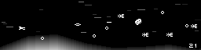

# NMSS

Small shoot them all game.

It's intendend for running on an 256x64 screen for an embedded product, hence
the small size of the window.
It runs on Linux, Windows and in a web browser.

(And yes, it's tiny.)

All the instructions are tested under debian stable (Stretch as of writing).

## Required tools for compilation

### For linux

As the root user:

    apt-get install make gcc pkg-config libsdl2-dev libsdl2-image-dev libsdl2-mixer-dev

### For Windows

As the root user:

    apt-get install gcc-mingw-w64

As a normal user:

    mkdir -p third_party
    cd third_party
    wget https://www.libsdl.org/release/SDL2-devel-2.0.9-mingw.tar.gz
    tar xf SDL2-devel*.tar.gz
    wget https://www.libsdl.org/projects/SDL_image/release/SDL2_image-devel-2.0.4-mingw.tar.gz
    tar xf SDL2_image-devel*.tar.gz
    cd -
    mkdir -p win_root
    make -C third_party/SDL2-2.0.9/ install-package arch=x86_64-w64-mingw32 prefix=${PWD}/win_root
    make -C third_party/SDL2_image-2.0.4/ install-package arch=x86_64-w64-mingw32 prefix=${PWD}/win_root

## For the web browser version (Emscripten)

    mkdir -p third_party
    git clone https://github.com/emscripten-core/emsdk.git
    ./emsdk install latest
    ./emsdk activate latest
    source ./emsdk_env.sh

## Build

### For Linux

    make nmss

### For Windows

    make nmss.exe

### For the web browser version

    make nmss.html

Get sure that **emsdk_env.sh** has been properly sourced beforehand.

## Running

### For Linux

    ./nmss

### For Windows

The executable can be ran under Linux through wine:

    cd win_root/bin
    ../../nmss.exe

For running on Windows directly, I don't know ^^

### For emscripten

    xdg-open nmss.html

## How to play

* **Arrows**: move the ship
* **A**: shoot
* **F**: toggle fullscreen
* **Space**: pause the game
